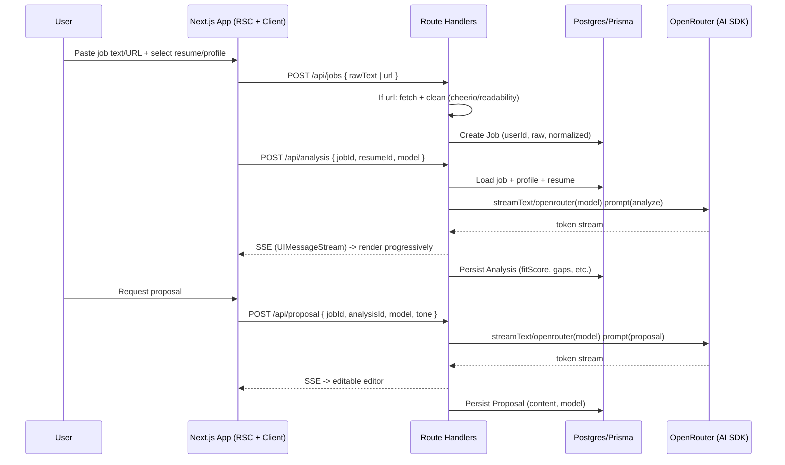

# feat: JobPilot MVP - Paste -> Analyze -> Proposal

## Overview

Greenfield MVP for JobPilot: a platform for developers/job seekers where a user pastes a job description or URL, the system cleans/extracts the job, runs an AI fit analysis against the user's persisted profile/resume, and streams a tailored proposal/cover letter via OpenRouter. Built on Next.js 16 (App Router, `src/`), TypeScript, Tailwind CSS 4, pnpm, PostgreSQL + Prisma 7 (with `@prisma/adapter-pg`), Auth.js v5 (email credentials + Google + GitHub), and Vercel AI SDK 5 with OpenRouter multi-model provider.

## Problem Frame

Job seekers across segments — freelance devs (Upwork/Toptal), full-time devs, generalists, and students — spend disproportionate time reading ambiguous job descriptions, self-assessing fit, identifying gaps, and writing bespoke proposals/cover letters. Existing tools are either generic trackers with no AI, or one-off ChatGPT prompts with no memory of the user's profile/resume and no structured extraction. JobPilot's hypothesis: a tight loop — **Paste job (text or URL) -> Structured analysis (fit score, gaps, highlights, red flags) grounded in your real profile/resume -> Draft proposal auto-tailored to the job type** — reduces time-to-apply and improves quality, and is a natural wedge before adding tracker/board features. The scaffold exists (`src/app/layout.tsx`, `src/app/page.tsx`) but contains only the create-next-app boilerplate; no domain, DB, auth, or AI exists yet. (see origin: `docs/brainstorms/2026-08-20-job-pilot-mvp-requirements.md`)

## Requirements Trace

**Job Ingestion (origin R1-R4)**
- R1. Paste raw job text OR public URL; at least one required.
- R2. URL fetch with 10s timeout, 3 redirects, HTML validation, readability cleaning; JS-heavy/no-text fallback to screenshot/OCR stretch or clear error + "paste text" guidance.
- R3. Normalize & persist title, company, cleaned description, requirements list, location/salary if present, source URL + raw text, owned by user.
- R4. Private/internal URL denylist (localhost, 10.*, 192.168.*, 172.16-31.*, etc.) with user-facing rejection.

**Profile & Resume (origin R5-R8)**
- R5. Persistent profile: bio, skills, yearsExp, links (portfolio/LinkedIn/GitHub), editable.
- R6. Multiple resumes (PDF/text, 10MB each), filename + extracted text as ground truth, list/preview/delete.
- R7. Per-job resume picker (defaults to most recent); analysis/proposal work with profile-only if no resume.
- R8. Empty/oversized/scanned-no-text upload handling with actionable 400/413 messages.

**AI Analysis (origin R9-R11)**
- R9. Persisted structured analysis: fitScore 0-100, matchedSkills[], gaps[], strengths[], redFlags[], summary (2-3 lines).
- R10. Streamed to UI (no reload), abortable (client cancel stops upstream), viewable after.
- R11. Per-call model picker from curated ~6 OpenRouter models (default balanced).

**Proposal Generation (origin R12-R15)**
- R12. Streamed tailored proposal/cover letter grounded strictly in selected resume/profile + job (no hallucinated skills), tone concise/detailed.
- R13. Auto-detect proposal type (freelance bid vs corporate cover letter) from job text cues, with user override picker.
- R14. Persisted per job with model/tone, history (multiple per job, latest current), editable + save/copy/download md, regeneratable with different model.
- R15. Same abortable streaming, no partial persist on abort.

**Auth & Ownership (origin R16-R17)**
- R16. Only authenticated users access own data; unauthenticated dashboard/API -> 401/302.
- R17. Email+password (hashed) + Google + GitHub OAuth; duplicate email -> 409.

**History & Navigation (origin R18-R20)**
- R18. Paginated job list (10/page) with status badges + search/filter by title/company/status.
- R19. Job detail with metadata + analysis tab + proposal tab (with histories).
- R20. Dashboard counts + recent jobs + "New Job" CTA; empty states guide first action.

**Cross-cutting (origin)**
- R7, R10, R15 imply single `globalForPrisma` singleton with `@prisma/adapter-pg`; streaming via Vercel AI SDK + `createOpenRouter` (see origin Key Decisions).

## Scope Boundaries

- No job board aggregation or scraping at scale (no Greenhouse/Lever APIs, no search index) in v1; only single-URL fetch for pasted links (generic HTML, not per-site parsers).
- No LinkedIn/GitHub profile import in v1; profile is manual + resume upload.
- No ATS integration, no email sending, no calendar/interview tracking (tracker Kanban is a future iteration).
- No payments/billing, no team/organization workspaces, no role-based admin.
- No browser extension.
- Screenshot/OCR fallback for JS-heavy URLs is a stretch goal — if not ready, fallback is clear error + "paste text" guidance (not a blocker).

### Deferred to Separate Tasks

- Job board aggregator & saved-search alerts: separate feat after MVP validation.
- Kanban application tracker (Applied/Interview/Offer): `feat: application tracker` follow-up.
- Resume parsing via dedicated PDF service / Vercel Blob storage hardening: may graduate from simple text extraction to a worker in a later task.
- Fine-grained RBAC and orgs: separate feat if multi-user is needed.
- Analytics/metrics dashboard for job search: future feat.

## Context & Research

### Relevant Code and Patterns

- Scaffold: `package.json` (Next 16.3.1, React 19.2, Tailwind 4.3.3, TS 5.9, pnpm 10.10, `src/` dir, alias `@/*` -> `src/*`), `src/app/layout.tsx` (Geist fonts, `LayoutProps<"/">`), `src/app/page.tsx` (boilerplate to replace), `src/app/globals.css` (Tailwind import), `next.config.ts` (empty), `tsconfig.json` (strict, `bundler` resolution), `postcss.config.mjs` (`@tailwindcss/postcss`), `eslint.config.mjs` (next/core-web-vitals). Build verified (`pnpm build` passes, Turbopack).
- No existing domain code, no `prisma/` dir, no `auth.ts`, no `src/lib/`, no API routes beyond `src/app/*`, no `src/components/`, no env validation, no tests. Local patterns are thin — plan must establish them.

### Institutional Learnings

- No `docs/solutions/` yet (greenfield). First implementation will set precedent for singleton Prisma client, Auth.js placement, and AI route conventions.

### External References

- Prisma 7 Next.js guide: `prisma.config.ts` holds `url` (not `schema.prisma` datasource), requires `@prisma/adapter-pg` + `PrismaPg` adapter, singleton via `globalForPrisma`, Node >=20.19 — source `/prisma/web` (singleton snippet).
- Auth.js v5 migration: `auth.ts` at project root with `PrismaAdapter(prisma)` and `session: { strategy: "jwt" }`, split `auth.config.ts` for edge, `proxy.ts` re-exports `auth as proxy`, route `src/app/api/auth/[...nextauth]/route.ts` re-exports `handlers` — source `/nextauthjs/next-auth`.
- Vercel AI SDK 5: `streamText`, `convertToModelMessages`, `createUIMessageStreamResponse`/`toUIMessageStream`, `createProviderRegistry` for multi-provider, `maxDuration` — source `/vercel/ai`.
- OpenRouter AI SDK provider: `createOpenRouter({ apiKey, appName })`, model via `openrouter("openai/gpt-4o")`, env `OPENROUTER_API_KEY`, optional `api_keys` map and `extraBody` — source `/openrouterteam/ai-sdk-provider`.

## Key Technical Decisions

- **Next.js 16 with App Router (`src/`):** Scaffold is already 16.3.1; user requested 15 but 15/16 APIs are compatible. Keep 16 (or pin to 15.5 if team prefers) to avoid churn; app dir and `@/*` alias retained. Rationale: latest stable, Turbopack, RSC by default, aligns with Vercel AI SDK docs. Tradeoff: slight drift from requested 15 but 16 is the LTS path; downgrade would only be churn if 15-specific behavior is needed (none identified).
- **Prisma 7 + `@prisma/adapter-pg` + `prisma.config.ts` vs. Drizzle:** Chose Prisma because requested explicitly and PrismaAdapter is first-class for Auth.js; Drizzle would be lighter but lacks adapter and requires manual schema for Auth.js tables. Prisma 7 pattern (no `url` in `schema.prisma`, adapter-based client, singleton in `src/lib/prisma.ts`) avoids connection-pool footguns in serverless via single `globalForPrisma` instance. Tradeoff: larger client bundle and migration opinions vs. Drizzle's SQL-close flexibility — accepted for velocity and Auth.js compatibility.
- **PostgreSQL:** As requested; local via Docker for dev, Vercel/Neon/Supabase Postgres for prod (deferred choice). Prisma Postgres also viable. Decision is swappable via `DATABASE_URL` abstraction.
- **Auth.js v5 (next-auth 5) with PrismaAdapter, JWT strategy vs. Clerk/Lucia:** Supports the requested Email (credentials) + Google + GitHub combination. Credentials needs a hashed password field on User; OAuth accounts go to `Account` table per PrismaAdapter schema. JWT keeps edge middleware light; `auth.config.ts` edge-safe. Clerk would offload auth but adds vendor lock-in and cost; Lucia is lighter but lacks built-in OAuth + PrismaAdapter. Tradeoff: Auth.js gives full data ownership and aligns with Prisma, at cost of owning password hashing and OAuth app setup.
- **Vercel AI SDK 5 + OpenRouter vs. direct OpenAI/Anthropic SDKs:** `createOpenRouter` factory is the provider, models are strings like `openai/gpt-4o` / `anthropic/claude-3.5-sonnet`. Streaming via `streamText` + `createUIMessageStreamResponse` in `src/app/api/analysis/route.ts` and `src/app/api/proposal/route.ts`. Chose OpenRouter to satisfy multi-model requirement with one key; direct SDKs would require per-provider keys and `createProviderRegistry` branching. Tradeoff: OpenRouter adds a hop and its `compatible` vs `strict` modes affect JSON strictness; we default to `compatible` and validate with Zod post-stream. Keep abstraction so a future direct provider can be added without changing prompts.
- **Validation:** Zod for env (`src/lib/env.ts`) and for AI structured output (`generateObject`/`streamObject` or JSON schema) plus request DTOs. Rationale: fail fast on missing `DATABASE_URL`, `AUTH_SECRET`, `OPENROUTER_API_KEY`, `GOOGLE_ID/SECRET`, `GITHUB_ID/SECRET`. Alternative (Valibot) is smaller but Zod is the ecosystem default for Prisma/Auth.js.
- **Resume storage v1:** Persist extracted text in Postgres (`Resume.contentText`) + raw file optionally to `public/uploads` or Vercel Blob later; PDF parsing via lightweight `pdf-parse` or similar. Chose DB-text-first to avoid blob infra in MVP; tradeoff is 10MB PDF limit and no durable file CDN — defer durable blob to hardening when retention matters. **Refined (see origin R6-R8):** support multiple resumes per user with per-job `resumeId` picker; Analysis/Proposal both carry `resumeId` FK.
- **UI:** Tailwind 4 + minimal `src/components/ui/*` (Button, Card, Textarea) inspired by shadcn; no heavy component lib lock-in yet. Tradeoff vs. full shadcn/ui: less scaffolding now, easy to adopt later.
- **Testing:** Vitest for unit/integration, Playwright for e2e (deferred to Unit 8 if needed). Prisma tests use isolated test DB or mocked client. Chose Vitest for Vite-native speed; Jest would work but is slower with ESM.
- **Proposal type auto-detection (origin R13):** Heuristic prompt branch that inspects job text for "Upwork/hourly/milestone" vs "cover letter/full-time/benefits" to choose freelance bid vs corporate letter, with user override. Keeps single profile model for all segments (freelance/FTE/generalist/student) vs separate schemas — low carrying cost.
- **URL screenshot/OCR fallback (origin R2):** Generic HTML readability extraction covers ~80% of job pages; screenshot fallback is stretch, not blocker. If JS-heavy page yields <200 chars of useful text, show "paste text" guidance instead of failing silently.

## Open Questions

### Resolved During Planning

- Core loop: Paste -> Analyze -> Proposal (user confirmed Q1).
- Profile source: Resume upload + manual skills, now multiple resumes with per-job picker (user confirmed Q2 + brainstorm R6-R7).
- AI provider: OpenRouter multi-model (user confirmed Q3; see origin R11,R14).
- Auth providers: Email (credentials) + Google + GitHub combined (user said "combine 3 and 4"; interpreted as all three via Auth.js v5; see origin R17).
- Primary user: all segments (freelance, FTE, generalist, student) with one profile model (brainstorm Q1).
- Proposal style: auto-detect freelance vs cover letter with override (brainstorm Q2; origin R13).
- Analysis depth: 5-part structured card (brainstorm Q3; origin R9).
- Job URL scope: generic HTML with screenshot/OCR stretch (brainstorm Q5; origin R2).
- Success metric: analysis accuracy >=90% reasonable (brainstorm Q6; origin Success Criteria).

### Deferred to Implementation

- Exact Prisma schema field names and indexes: depends on final `schema.prisma` authoring and migration preview. Add `resumeId` FK on `Job`/`Analysis`/`Proposal` for multi-resume picker (origin R7) and `proposalType` enum for auto-detect (origin R13).
- PDF parsing library choice (`pdf-parse` vs `unpdf` vs server-side `pdfjs`): evaluate during Unit 4 when handling binary uploads.
- Whether to enforce `strict` compatibility on OpenRouter or default `compatible`: test during Unit 6 with real models; default to `compatible` unless strict JSON is needed.
- Proposal export format beyond copy/markdown (PDF/DOCX): defer; add if user requests.
- Hosting for Postgres in prod (Neon/Supabase/Prisma Postgres/Vercel Postgres): defer to Operational Notes; `DATABASE_URL` abstraction keeps it swappable.
- Rate limiting for AI routes (per-user per-minute): defer to hardening after MVP; document as future `src/lib/rate-limit.ts`.
- Auto-detection heuristic tuning and private-IP denylist exact ranges: refine during Units 5 and 7 with real job samples.

## Output Structure

```
src/
  app/
    (marketing)/page.tsx            # landing (replaces src/app/page.tsx boilerplate)
    (dashboard)/
      layout.tsx                    # auth-guarded shell + nav
      dashboard/page.tsx
      jobs/
        page.tsx                    # list
        new/page.tsx                # paste form
        [id]/page.tsx               # job detail with analysis/proposal tabs
      profile/page.tsx
      settings/page.tsx
    api/
      auth/[...nextauth]/route.ts
      jobs/route.ts                 # POST create, GET list
      jobs/[id]/route.ts
      analysis/route.ts             # POST stream analysis for a job
      proposal/route.ts             # POST stream proposal
      upload/resume/route.ts
  components/
    ui/{button,card,textarea,input}.tsx
    jobs/{job-form, job-card, analysis-view, proposal-editor}.tsx
    profile/{profile-form, resume-uploader}.tsx
  lib/
    prisma.ts
    env.ts
    auth.config.ts
    ai/
      openrouter.ts                 # createOpenRouter singleton
      prompts/{analyze,proposal}.ts
      schemas/{analysis,proposal}.ts # Zod schemas for structured output
  hooks/{use-stream-analysis, use-stream-proposal}.ts
prisma/
  schema.prisma
  migrations/
  seed.ts
auth.ts                             # root NextAuth config (PrismaAdapter)
proxy.ts                            # auth as proxy (middleware)
```

## High-Level Technical Design

> *This illustrates the intended approach and is directional guidance for review, not implementation specification. The implementing agent should treat it as context, not code to reproduce.*



Pseudo-contract sketch (directional):

- `POST /api/jobs` accepts `{ rawText?: string, url?: string }`, returns `Job`. Validation: one of rawText/url required, URL fetch timeout 10s, SSRF guard (block private IPs).
- `POST /api/analysis` accepts `{ jobId, resumeId?, model?: string }`, streams `AnalysisChunk` and finally persists `Analysis` with `fitScore, matchedSkills[], gaps[], highlights[], redFlags[], summary`.
- `POST /api/proposal` accepts `{ jobId, analysisId?, resumeId?, model?, tone?: "concise"|"detailed" }`, streams proposal markdown.

## Implementation Units

- [ ] **Unit 1: Foundation — App shell, env, and tooling**

**Goal:** Replace boilerplate with JobPilot shell, add env validation, establish conventions and test harness.

**Requirements:** R7 (basis), R6 (routing basis), R9 (layout)

**Dependencies:** None

**Files:**
- Modify: `src/app/layout.tsx`, `src/app/page.tsx`, `src/app/globals.css`, `next.config.ts`, `tsconfig.json`, `eslint.config.mjs`, `package.json`
- Create: `src/components/ui/button.tsx`, `src/components/ui/card.tsx`, `src/lib/env.ts`, `src/app/(marketing)/page.tsx`, `src/app/(dashboard)/layout.tsx`, `.env.example`, `vitest.config.ts`
- Test: `src/lib/env.test.ts`, `src/app/(marketing)/page.test.tsx`

**Approach:**
- Replace `src/app/page.tsx:3` boilerplate with minimal marketing landing + CTA to `/dashboard`; guarded dashboard layout with nav (Jobs/Profile/Settings) that checks session.
- Centralize env validation with Zod in `src/lib/env.ts` (required: `DATABASE_URL`, `AUTH_SECRET`, `OPENROUTER_API_KEY`, `GOOGLE_CLIENT_ID/SECRET`, `GITHUB_ID/SECRET`); fail at build/dev start with clear messages.
- Add Vitest config and example test; keep pnpm scripts `dev/build/lint/test`.
- Update `next.config.ts` for `serverExternalPackages` if needed for Prisma/pdf.

**Patterns to follow:**
- Existing alias `@/*` -> `src/*` (`tsconfig.json:20`), Tailwind 4 in `src/app/globals.css:1`, App Router file conventions.

**Test scenarios:**
- Happy path: `env.test.ts` — valid env parses successfully.
- Edge case: missing optional OAuth vars in dev -> warns but not throw; missing `OPENROUTER_API_KEY` -> throws with field name.
- Error path: invalid `DATABASE_URL` format -> Zod error mentioning expected postgres URL.
- Integration: landing page renders CTA linking to `/dashboard`.

**Verification:**
- `pnpm build` passes, landing at `/` and `/dashboard` (redirect to sign-in when unauthenticated) render; `pnpm test` runs.

- [ ] **Unit 2: Persistence — Prisma Postgres and domain model**

**Goal:** Introduce Prisma 7 with Postgres, singleton client, migrations, and core schema for users/jobs/analyses/proposals.

**Requirements:** R7, R6 (User/Account), R1,R2,R3,R4 persistence

**Dependencies:** Unit 1

**Files:**
- Create: `prisma/schema.prisma`, `prisma.config.ts`, `prisma/seed.ts`, `src/lib/prisma.ts`, `src/lib/db.test.ts`
- Modify: `package.json`, `.env.example`, `.gitignore`
- Test: `src/lib/prisma.test.ts`, `prisma/schema.test.ts` (snapshot of expected models)

**Approach:**
- Follow Prisma 7 pattern: `prisma.config.ts` defines `url` from env; `schema.prisma` datasource without `url`; generator `prisma-client-js` with `runtime = "nodejs"` if needed.
- Singleton `src/lib/prisma.ts` using `globalForPrisma` + `new PrismaPg({ connectionString })` from `@prisma/adapter-pg` (per `/prisma/web` snippet); export `prisma`.
- Models: `User` (id, email, passwordHash?, name, image, createdAt), `Account/Session/VerificationToken` per PrismaAdapter, `Profile` (userId 1:1, bio, skills Json/string[], links), `Resume` (id, userId FK, filename, contentText, createdAt), `Job` (id, userId FK, title, company, rawText, normalizedDescription, requirements Json, url, createdAt), `Analysis` (id, jobId FK, userId FK, model, fitScore, matchedSkills, gaps, highlights, redFlags, summary, createdAt), `Proposal` (id, jobId FK, analysisId FK?, userId FK, model, content Markdown, tone). Add indexes on `userId`, `jobId`.
- Provide `prisma/seed.ts` for demo user/profile/job.
- Docker `docker-compose.yml` (optional) for local Postgres or document `DATABASE_URL` for hosted.

**Patterns to follow:**
- Prisma singleton pattern from Context7 `/prisma/web`; keep `DATABASE_URL` server-only (never expose to client).

**Test scenarios:**
- Happy path: Prisma client imports and can run `prisma.$queryRaw` SELECT 1 in test DB.
- Edge case: singleton returns same instance across hot reload (call twice returns `===`).
- Error path: missing `DATABASE_URL` -> `src/lib/prisma.ts` throws at import-time with actionable message.
- Integration: `prisma migrate dev` creates tables; seed inserts user + job + analysis.

**Verification:**
- `pnpm prisma migrate dev` (or `pnpm dlx prisma migrate dev`) runs, `prisma studio` shows tables, `pnpm build` still passes.

- [ ] **Unit 3: Auth — Auth.js v5 with PrismaAdapter, credentials + OAuth, protected routes**

**Goal:** Users can sign up/sign in via email+password and via Google/GitHub OAuth; sessions protect dashboard/API routes.

**Requirements:** R6

**Dependencies:** Unit 2

**Files:**
- Create: `auth.ts`, `proxy.ts`, `src/lib/auth.config.ts`, `src/app/api/auth/[...nextauth]/route.ts`, `src/app/(auth)/signin/page.tsx`, `src/app/(auth)/signup/page.tsx`, `src/app/api/auth/signup/route.ts`, `src/lib/password.ts`
- Modify: `prisma/schema.prisma` (ensure User/Account/Session models match adapter), `src/app/(dashboard)/layout.tsx`
- Test: `src/lib/password.test.ts`, `src/app/api/auth/signup.test.ts`, `src/lib/auth.config.test.ts`

**Approach:**
- Root `auth.ts` exports `{ handlers, auth, signIn, signOut } = NextAuth({ adapter: PrismaAdapter(prisma), session:{ strategy:"jwt" }, ...authConfig })` per `/nextauthjs/next-auth` snippet.
- `src/lib/auth.config.ts` holds providers: `Credentials({ authorize: verify email+bcrypt })`, `Google`, `GitHub`; edge-compatible.
- `proxy.ts` re-exports `auth as proxy` to guard `/dashboard/*` and `/api/jobs|analysis|proposal|upload`; redirect to `/signin`.
- Signup route hashes password with `bcryptjs`, creates User + Profile row transactionally; handles duplicate email with 409.
- Signin page supports both credential form and OAuth buttons; use `signIn` server actions.
- Keep `AUTH_SECRET` in env; set `AUTH_URL` for prod.

**Patterns to follow:**
- Auth.js v5 file placement (`auth.ts` root, `proxy.ts` for middleware) and `handlers` re-export route.

**Test scenarios:**
- Happy path: signup with valid email/password creates user (password stored hashed, not plaintext) and redirects to signin.
- Happy path: OAuth provider config exists (Google/GitHub) and `handlers` respond to `GET /api/auth/providers`.
- Edge case: signup with existing email -> 409 with user-friendly message.
- Error path: signin with wrong password -> 401, no session cookie set.
- Integration: accessing `/dashboard/jobs` unauthenticated -> 302 to `/signin`; authenticated -> 200.

**Verification:**
- Manual sign-up + sign-in (credentials and one OAuth) works; `auth()` returns session in server component; protected routes enforce auth.

- [ ] **Unit 4: Profile & Resume management**

**Goal:** Authenticated user can manage a persistent profile and upload/edit multiple resumes that AI will use as ground truth, with per-job resume picker.

**Requirements:** R5,R6,R7,R8 (origin)

**Dependencies:** Units 2, 3

**Files:**
- Create: `src/app/(dashboard)/profile/page.tsx`, `src/app/api/profile/route.ts`, `src/app/api/upload/resume/route.ts`, `src/components/profile/profile-form.tsx`, `src/components/profile/resume-uploader.tsx`, `src/lib/pdf.ts`
- Modify: `prisma/schema.prisma` (Resume fields + indexes; prepare `resumeId` FK for Job/Analysis/Proposal in Units 5-7)
- Test: `src/app/api/profile/route.test.ts`, `src/app/api/upload/resume/route.test.ts`, `src/lib/pdf.test.ts`

**Approach:**
- `GET/PUT /api/profile` for the current user's `Profile` (bio, skills[], yearsExp, links); Zod validation; upsert.
- `POST /api/upload/resume` accepts `multipart/form-data` (PDF or text), extracts text (v1: `pdf-parse`/`unpdf` with 10MB limit), stores `Resume { filename, contentText, userId }`, returns id. List + delete endpoints; support multiple resumes per user (origin R6) with list/preview.
- Client `profile/page.tsx` shows `ProfileForm` + `ResumeUploader` + resume list (with preview of first 500 chars, delete action, and "default" marker).
- Prepare for per-job picker (origin R7): expose `GET /api/resumes` for dropdown used in Units 5-7; handle large PDFs, scanned PDFs (no text -> error with guidance to paste text), and concurrent uploads.

**Patterns to follow:**
- Route handler validation with Zod, use `auth()` to get `session.user.id`, scope all queries by `userId`.

**Test scenarios:**
- Happy path: PUT profile with valid skills array persists and GET returns it.
- Happy path: upload small PDF (contains "Experienced React developer") -> `contentText` contains that string.
- Happy path: upload two distinct resumes ("Frontend" and "Backend") -> both listed with separate ids; delete one leaves the other.
- Edge case: upload empty file -> 400 "File is empty".
- Edge case: upload 12MB file -> 413 "File too large".
- Error path: unauthenticated upload -> 401.
- Integration: after upload, `GET /api/profile` + resume list includes new resume; analysis can select it via `resumeId`.

**Verification:**
- User can create/edit profile, upload multiple PDF and text resumes, see them listed with preview; data in `Profile` and `Resume` tables scoped to user; `GET /api/resumes` returns own resumes only.

- [ ] **Unit 5: Job ingestion — paste text or URL**

**Goal:** User can create a job from pasted text or a public URL; system fetches, cleans, normalizes, and persists the job, with per-job resume selection and stretch screenshot fallback.

**Requirements:** R1,R2,R3,R4,R7 (origin)

**Dependencies:** Units 2, 3

**Files:**
- Create: `src/app/(dashboard)/jobs/new/page.tsx`, `src/app/(dashboard)/jobs/page.tsx`, `src/app/(dashboard)/jobs/[id]/page.tsx`, `src/app/api/jobs/route.ts`, `src/app/api/jobs/[id]/route.ts`, `src/lib/jobs/normalize.ts`, `src/components/jobs/job-form.tsx`, `src/components/jobs/job-card.tsx`
- Modify: `prisma/schema.prisma` (Job.resumeId FK optional for per-job resume choice, see origin R7)
- Test: `src/lib/jobs/normalize.test.ts`, `src/app/api/jobs/route.test.ts`

**Approach:**
- `POST /api/jobs` accepts `{ rawText?: string, url?: string, title?: string, resumeId?: string }` (at least one of rawText/url required). If `url`, server fetches with 10s timeout, max 3 redirects, validates content-type html, extracts main text via `cheerio` or readability (strip scripts/nav), normalizes whitespace; if extracted text <200 chars or content-type non-HTML/JS-heavy, stretch path is screenshot/OCR, otherwise return 400 with "Could not extract — please paste text" guidance (not a blocker for v1, see Scope Boundaries). Basic heuristic to extract title/company if not provided (first h1, meta). Always store `rawText` and `normalizedDescription`, plus `resumeId` if provided.
- SSRF guard: deny `localhost`, `127.0.0.1`, `10.*`, `192.168.*`, `172.16-31.*`, `0.0.0.0`, `file://`; cap redirects, 10s timeout.
- `GET /api/jobs` lists current user's jobs ordered by `createdAt desc` with pagination; `GET /api/jobs/[id]` fetches one (404 if not owned); include selected resume name.
- UI: `jobs/new` has tabs Text/URL, resume dropdown (defaults to most recent, see origin R7), `jobs/page` lists cards with status badges (no analysis / analyzed / proposal ready), `jobs/[id]` shows job detail.

**Patterns to follow:**
- Standard App Router `src/app/api/*/route.ts` handlers, Zod DTOs, `auth()` scoping.

**Test scenarios:**
- Happy path: POST with `rawText` containing "Senior React Developer at Acme" creates Job with `normalizedDescription` trimmed and `userId` set.
- Happy path: POST with `url: https://example.com/job` (mock fetch returning HTML with `<h1>`) -> extracts title and description; with `resumeId` -> persisted on Job.
- Edge case: POST with both empty -> 400 "Provide job text or URL".
- Edge case: POST with URL pointing to `http://localhost:3000` -> 400 "URL not allowed".
- Edge case: JS-heavy URL yielding <200 chars -> 400 with guidance to paste text (screenshot fallback deferred).
- Error path: fetch timeout or 404 -> 502 with "Could not fetch URL" and no Job created.
- Integration: created job appears in `GET /api/jobs` and `jobs/page.tsx`.

**Verification:**
- User can paste text and separately paste a URL to create two jobs (with resume choice); both appear in list and detail shows cleaned description; private-IP URLs are rejected; JS-heavy fallback shows correct guidance.

- [ ] **Unit 6: AI analysis — fit scoring vs. profile/resume (OpenRouter streaming)**

**Goal:** For a given job, stream a structured fit analysis using the user's profile/selected resume and chosen OpenRouter model.

**Requirements:** R9,R10,R11 (origin)

**Dependencies:** Units 2, 4, 5

**Files:**
- Create: `src/app/api/analysis/route.ts`, `src/lib/ai/openrouter.ts`, `src/lib/ai/prompts/analyze.ts`, `src/lib/ai/schemas/analysis.ts`, `src/components/jobs/analysis-view.tsx`, `src/hooks/use-stream-analysis.ts`
- Modify: `prisma/schema.prisma` (Analysis fields + resumeId/model if needed)
- Test: `src/lib/ai/schemas/analysis.test.ts`, `src/app/api/analysis/route.test.ts`, `src/lib/ai/prompts/analyze.test.ts`

**Approach:**
- Singleton `src/lib/ai/openrouter.ts` via `createOpenRouter({ apiKey: process.env.OPENROUTER_API_KEY, appName: "JobPilot" })`.
- Prompt `src/lib/ai/prompts/analyze.ts` composes system + user messages from job + profile + selected resume `contentText` (default to Job.resumeId or most recent resume; truncate to ~8k chars with priority: job full, resume summary). Instruct model to return JSON matching `AnalysisSchema` (Zod): `{ fitScore: 0-100, matchedSkills: string[], gaps: string[], strengths: string[], redFlags: string[], summary: string }`.
- Route `POST /api/analysis { jobId, resumeId?, model?: string }` loads owned job/resume/profile (resumeId defaults to job's resumeId), validates `model` against allowlist (or allow any OpenRouter slug but validate format `provider/model`), calls `streamText` or `streamObject` (prefer `streamObject` with Zod schema for structured streaming; fallback to `generateObject` + stream text). Stream via `createUIMessageStreamResponse` / `toUIMessageStream` to `analysis-view.tsx`. On completion, persist `Analysis` row with `resumeId` and `model`.
- Model picker defaults to `openai/gpt-4o` but lets user choose (dropdown of ~6 curated models).
- Abort: `req.signal` passed to `streamText` so client cancel aborts upstream.

**Patterns to follow:**
- Vercel AI SDK streaming pattern from `/vercel/ai` (convertToModelMessages, streamText, createUIMessageStreamResponse) and OpenRouter provider from `/openrouterteam/ai-sdk-provider`.

**Test scenarios:**
- Happy path: POST with valid jobId + resumeId streams chunks containing `fitScore` and `summary`; DB has new `Analysis` after stream ends.
- Happy path: `model: "anthropic/claude-3.5-sonnet"` is accepted and passed to `openrouter(model)`.
- Edge case: job description > 15k chars -> truncated gracefully, still returns analysis (no 500).
- Edge case: user has no resume -> analysis uses profile only and still succeeds (no gap due to missing resume).
- Error path: invalid `jobId` (not owned) -> 404; missing `OPENROUTER_API_KEY` -> 500 with "AI provider not configured" (not leaking key).
- Integration: streaming view renders incrementally and shows final persisted analysis on refresh; job's resumeId default is respected.

**Verification:**
- From `jobs/[id]` click "Analyze" (with resume picker) -> streaming fit score + sections appear token-by-token; analysis is persisted with correct `resumeId` and listed; switching model re-runs with new model tag.

- [ ] **Unit 7: Proposal generation — streamed tailored proposal/cover letter (auto-detect type)**

**Goal:** From job + analysis + profile/selected resume, stream an editable, regeneratable proposal/cover letter with auto-detected type (freelance bid vs corporate cover letter) and persist it.

**Requirements:** R12,R13,R14,R15 (origin)

**Dependencies:** Units 2, 4, 5, 6

**Files:**
- Create: `src/app/api/proposal/route.ts`, `src/lib/ai/prompts/proposal.ts`, `src/lib/ai/schemas/proposal.ts`, `src/components/jobs/proposal-editor.tsx`, `src/hooks/use-stream-proposal.ts`
- Modify: `prisma/schema.prisma` (Proposal.proposalType enum: `FREELANCE_BID | COVER_LETTER` + tone)
- Test: `src/lib/ai/prompts/proposal.test.ts`, `src/app/api/proposal/route.test.ts`

**Approach:**
- Prompt `proposal.ts` grounds generation in job requirements, analysis highlights/gaps (to proactively address gaps), and selected resume/profile (to avoid hallucinating skills). Supports `tone` (concise/detailed) and `proposalType` auto-detected via heuristic (job text cues: "Upwork/hourly/milestone" -> FREELANCE_BID vs "full-time/cover letter/benefits" -> COVER_LETTER) with user override picker; detection runs server-side before prompt assembly and is stored on the Proposal.
- Route `POST /api/proposal { jobId, analysisId?, resumeId?, model?, tone?, proposalType?: "auto"|"freelance"|"cover_letter" }` similar streaming pattern to analysis but output is markdown. Stream to `proposal-editor.tsx` (textarea/rich view) where user can edit inline, copy, download `.md`, and click "Regenerate" (optionally with different model/type).
- Persist `Proposal { content, model, tone, proposalType, jobId, analysisId, resumeId }`; keep history (multiple proposals per job) and mark latest as `current`.
- Ensure proposal never claims skills not in profile/resume (prompt instruction + optional post-check for hallucinated skills).

**Patterns to follow:**
- Same AI SDK streaming as Unit 6; reuse `openrouter` singleton; use `maxDuration = 60` for long generations.

**Test scenarios:**
- Happy path: POST with valid job+analysis streams markdown containing job title/company and at least one skill from selected resume; `proposalType` is auto-set and persisted.
- Happy path: `tone: "concise"` produces shorter output than `tone: "detailed"` (snapshot length check); `proposalType: "freelance"` vs `"cover_letter"` yields different structure.
- Happy path: Upwork-style JD containing "hourly rate" -> auto-detect `FREELANCE_BID`; corporate JD containing "full-time benefits" -> `COVER_LETTER`.
- Edge case: no prior analysis (analysisId missing) -> still generates proposal from job+profile (analysis is optional).
- Error path: client aborts mid-stream -> server handler respects `abortSignal`, no partial Proposal is persisted (or marks as incomplete).
- Integration: proposal appears in `jobs/[id]` proposals tab and survives page reload; edit + save updates persisted content; history shows type badge.

**Verification:**
- User can generate, see streamed proposal (with auto-detected type badge), edit text, save, copy, and regenerate with a different model/type; proposals are listed per job with model tag, type, and timestamps; override picker changes type.

- [ ] **Unit 8: Dashboard, history, and hardening**

**Goal:** Provide a usable dashboard, polish empty/loading/error states, add pagination/filters, basic e2e, and deployment docs.

**Requirements:** R9, cross-cutting polish

**Dependencies:** Units 1-7

**Files:**
- Create: `src/app/(dashboard)/dashboard/page.tsx`, `src/app/(dashboard)/settings/page.tsx`, `src/components/jobs/job-filters.tsx`, `e2e/job-pilot.spec.ts`, `docs/deployment.md`
- Modify: `src/app/(dashboard)/jobs/page.tsx`, `src/components/ui/*`
- Test: `e2e/job-pilot.spec.ts`, `src/app/(dashboard)/jobs/page.test.tsx`

**Approach:**
- `dashboard/page.tsx` shows counts (total jobs, analyzed, proposals), recent jobs (3), quick action "New Job".
- `jobs/page.tsx` adds pagination (10/page), filter by status (needs analysis / analyzed / has proposal), and search by title/company.
- `settings/page.tsx` lets user manage profile link, default model, and view API key status (never reveal full key).
- Add loading skeletons and error boundaries for jobs/analysis/proposal views.
- E2E: sign up -> create job (text) -> analyze (mock or real with test key) -> generate proposal -> verify persistence.
- Deployment doc: env table, `pnpm prisma migrate deploy`, hosting Postgres, setting `AUTH_SECRET` (generate via `openssl rand -base64 32`), `OPENROUTER_API_KEY` from openrouter.ai.

**Patterns to follow:**
- Server Components for lists (`prisma.job.findMany` with `where: { userId }`), Client Components only for streaming/editor.

**Test scenarios:**
- Happy path: dashboard shows correct counts after seeding 2 jobs (1 analyzed).
- Edge case: jobs list with 0 jobs shows empty state with "Create your first job" CTA.
- Edge case: search with no matches shows "No results" without error.
- Integration: e2e `paste -> create -> analyze -> proposal` completes and data visible after reload.

**Verification:**
- Dashboard/history works with real data, pagination/filter/search behave, e2e passes on local, deployment doc is accurate.

## System-Wide Impact

- **Interaction graph:** `proxy.ts` (Auth.js) gates `src/app/(dashboard)/*` and `src/app/api/jobs|analysis|proposal|upload/*`; `prisma` singleton is imported by all server routes and `auth.ts`; AI routes (`src/app/api/analysis/route.ts`, `src/app/api/proposal/route.ts`) depend on `src/lib/ai/openrouter.ts` + `prisma` + `auth()`; client hooks (`src/hooks/use-stream-*`) consume the streaming routes.
- **Error propagation:** Route handlers throw `401` (no session), `404` (not owned), `400` (validation), `413/502` (upload/fetch), `500` (AI provider not configured). Client views map these to toast/inline messages; streaming errors surface via SSE `error` chunk and are not persisted.
- **State lifecycle risks:** Partial `Analysis`/`Proposal` on stream abort must not leave half-written rows; solution: persist only after stream completes (or use transaction). Concurrent analysis/proposal for same job is allowed (new rows, not overwrite); `Job` creation and `Analysis` creation are not atomic together — analysis always references an existing job.
- **API surface parity:** The same job/profile data is used by both analysis and proposal; changes to `src/lib/ai/schemas/*` must be kept in sync with prompt and DB columns. No external webhook parity needed in v1.
- **Integration coverage:** Unit tests alone will not prove: (a) `POST /api/jobs` with real URL fetch + SSRF guard, (b) streaming actually arrives incrementally to `analysis-view.tsx`/`proposal-editor.tsx`, (c) `auth()` + `proxy.ts` actually redirects unauthenticated dashboard/API callers, (d) `OPENROUTER_API_KEY` missing is handled without leaking secrets. These require route + component + DB integration tests (and one mocked OpenRouter e2e).
- **Unchanged invariants:** Existing `src/app/layout.tsx` font setup and Tailwind import remain; `tsconfig.json:20` alias `@/*` unchanged; `next.config.ts` stays minimal; no change to `public/` assets in this plan.

## Alternative Approaches Considered

- **Drizzle ORM instead of Prisma:** Drizzle is lighter and closer to SQL but lacks an official Auth.js adapter; would require hand-writing `Account/Session` tables and custom adapter. Rejected because PrismaAdapter is mature and user explicitly requested Prisma.
- **Clerk / Lucia for auth:** Clerk would speed up auth UX but introduces vendor lock-in and recurring cost; Lucia is minimal but needs manual OAuth wiring. Auth.js v5 gives full control, fits Prisma, and covers the requested provider matrix.
- **Direct OpenAI/Anthropic SDKs instead of OpenRouter:** Direct SDKs give tighter control per provider but require managing multiple keys and routing logic. OpenRouter satisfies multi-model via one key and one `createOpenRouter` factory; tradeoff is extra hop and compatibility modes, accepted for MVP.
- **tRPC for API layer:** tRPC would give end-to-end types but is overkill for 5 REST routes; App Router route handlers with Zod validation are simpler and align with Auth.js/AI SDK examples.
- **Vercel Blob / S3 for resume files vs DB text:** Storing raw PDFs in blob is more durable but adds infra for MVP where only extracted text is needed. Deferred to hardening.

## Success Metrics

- **Primary (origin):** Human spot-check finds >=90% of analyses "reasonable" — fitScore and gaps align with quick manual reading (sample 20 diverse jobs across freelance/FTE/student roles).
- Time-to-value: median paste -> first proposal < 2 minutes for 500-1500 word job without page reload (measured via analytics).
- Analysis returns fitScore + at least 3 matchedSkills + 2 gaps for jobs with clear requirements; proposal is grounded (no hallucinated skills in 95% of spot-checks) and auto-detect picks correct proposal type in >=80% of spot-checks.
- Auth: sign-up + Google + GitHub sign-in each work; unauthenticated access to `/dashboard` and `/api/jobs` is denied.
- Build (`pnpm build`) and lint pass; at least one integration test per unit's happy path.

## Dependencies / Prerequisites

- Node >= 20.19 (for Prisma 7), pnpm 10.x.
- PostgreSQL instance (Docker `postgres:16` for local, or hosted Neon/Supabase/Prisma Postgres).
- OpenRouter account + `OPENROUTER_API_KEY`; curated allowlist of 6 models tested at least once.
- Google Cloud OAuth app + GitHub OAuth app (client IDs/secrets) for OAuth paths; credentials path works without them but OAuth buttons hide if not configured.

## Risk Analysis & Mitigation

| Risk | Likelihood | Impact | Mitigation |
|------|------------|--------|------------|
| OpenRouter key leaks to client or logs | Low | High | Keep `OPENROUTER_API_KEY` server-only, access only in `src/lib/ai/openrouter.ts` and route handlers; never include in client bundle; `src/lib/env.ts` validation and lint rule for `process.env` in client. |
| LLM hallucinates skills not in resume | Medium | Medium | Ground proposal prompt explicitly with profile/resume allowlist; add post-generation check (optional) that flags hallucinated skills; show warning in editor. |
| Large PDFs / scanned PDFs with no extractable text | Medium | Low | Enforce 10MB limit, handle empty extraction with 400 + guidance; allow fallback to pasted text resume; document in UI. |
| SSRF via URL paste | Low | High | Deny private IP ranges, cap redirects (3), 10s timeout, validate http/https only, no `file://`. |
| Streaming costs / runaway tokens | Medium | Medium | Cap `maxDuration 60`, limit input truncation (~8k chars), cap `maxTokens` per call, log model + token usage server-side; advise caps in OpenRouter dashboard. |
| Auth misconfig (missing AUTH_SECRET / OAuth ids) | Medium | High | `src/lib/env.ts` fails fast with clear message; document generation of `AUTH_SECRET` in `docs/deployment.md`; hide OAuth buttons if IDs missing. |
| Prisma connection pool exhaustion in serverless | Low | High | Use `@prisma/adapter-pg` singleton pattern (`globalForPrisma`) per `/prisma/web`; avoid creating new `PrismaClient` per request. |
| Next.js 15 vs 16 drift | Low | Low | Pin `next` to `16.3.1` already in `package.json:12`; if team requires 15, do a single downgrade commit before Unit 1. |

## Phased Delivery

### Phase 1 — Foundations (Units 1-3)
App shell + env + Prisma Postgres + Auth. Goal: authenticated skeleton where DB migrations and sign-in work. Unblocks all domain work. Sequence is strict because 3 depends on 2, 2 depends on 1.

### Phase 2 — Core Domain (Units 4-5)
Profile/resume and job ingestion. Can be built in parallel after Phase 1 (4 and 5 share only Units 2/3), but both must land before AI.

### Phase 3 — AI (Units 6-7)
Analysis then proposal; 7 depends on 6 (proposal prompt benefits from analysis output, though it can run without it). Both depend on 4+5 for data.

### Phase 4 — Polish (Unit 8)
Dashboard/history, filters, e2e, deployment docs. Only after all features exist.

## Documentation Plan

- `docs/deployment.md`: env table, Docker local DB, `prisma migrate dev/deploy`, `AUTH_SECRET` generation, OAuth app setup, `OPENROUTER_API_KEY` procurement.
- `.env.example` kept in sync with `src/lib/env.ts`.
- `README.md` updated with `pnpm dev` / `pnpm build` and stack overview after Unit 1.

## Operational / Rollout Notes

- Env: `DATABASE_URL` (postgres), `AUTH_SECRET` (`openssl rand -base64 32`), `AUTH_URL` (prod), `OPENROUTER_API_KEY`, `GOOGLE_CLIENT_ID/SECRET`, `GITHUB_ID/SECRET`. Document in `.env.example` and `docs/deployment.md`.
- DB: local `docker-compose.yml` with `postgres:16`, `pnpm prisma migrate dev` for dev, `prisma migrate deploy` for prod (CI/CD).
- Deployment: Vercel (or any Node host) with `pnpm build`; set env vars in host; run migrations on deploy. No special edge config; `proxy.ts` is the middleware entry (Next.js 16 rename from `middleware.ts`).
- Monitoring (deferred): log AI model, latency, token count per analysis/proposal; add Sentry later if needed.
- Cost: OpenRouter usage per token; advise setting monthly cap in OpenRouter dashboard and curating default cheap model.
- Rollback: DB migrations are forward-only; keep each migration small; test seed before promoting to prod.

## Sources & References

- **Origin:** No upstream `docs/brainstorms/*-requirements.md`; bootstrap answers from planning Q&A (Paste->Analyze->Proposal, resume+profile, OpenRouter, Email+Google+GitHub).
- Related code: `package.json`, `src/app/layout.tsx`, `src/app/page.tsx`, `src/app/globals.css`, `next.config.ts`, `tsconfig.json`, `postcss.config.mjs`, `eslint.config.mjs` (all repo-root, scoped via `@/*`).
- External docs: `/prisma/web` (Prisma 7 singleton + `prisma.config.ts`), `/nextauthjs/next-auth` (Auth.js v5 `PrismaAdapter`, `handlers`/`auth`/`signIn`/`signOut`, `auth.config.ts`, `proxy.ts`, `[...nextauth]` route), `/vercel/ai` (AI SDK 5 `streamText`, `createUIMessageStreamResponse`, `maxDuration`), `/openrouterteam/ai-sdk-provider` (`createOpenRouter`, `openrouter(model)`, env `OPENROUTER_API_KEY`).

